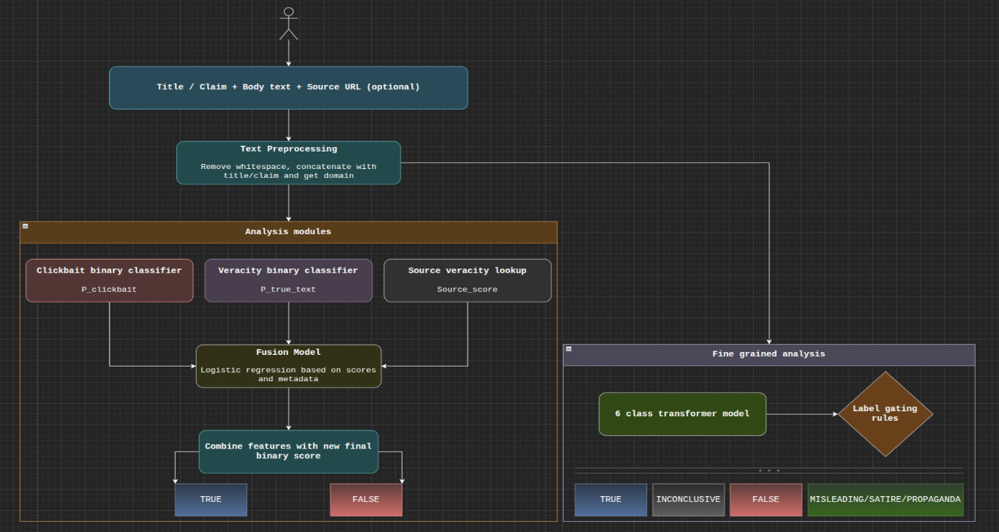
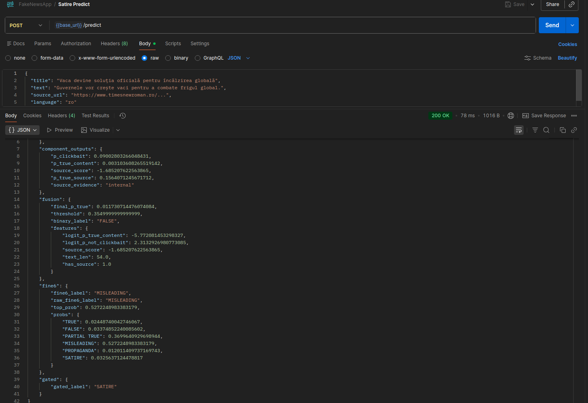
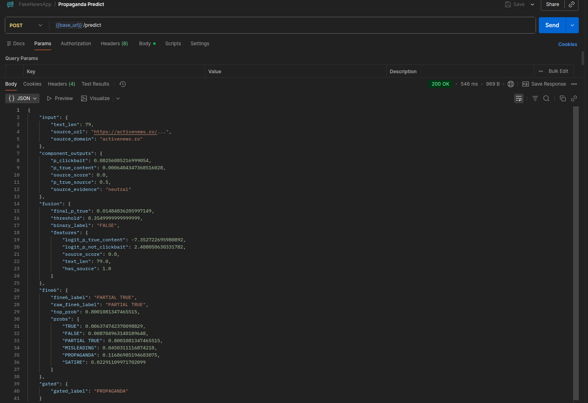

# NLP-FakeNews-Detection-Classifier

## Description
This is the project for NLP 2nd year class. There were a couple of options to choose from and I decided to go with a Fake News
Detection/Classifier for Romanian. Essentially, we have 2 stage pipeline system:
1. TRUE/FALSE classification done by multiple modules
2. Fine grained analysis (multiclass labeling)


No public and comprehensive dataset found yet for this task, so I decided to try and web scrape a couple of fact checking websites
(Factual, Veridica, RoCliCo) and also add clickbait (RoCliCo) and satire (Times New Roman) in order to cover multiple syntactic and 
semantic aspects of misinformation. Many attempts have been tried, but current final app uses `RoBERT` for:
- clickbait binary classifier (fine-tuned and changed final layer for binary crossentropy loss)
- multiclass labeling (fine-tuned and changed final layer for crossentropy loss)
- base TRUE/FALSE classifier (fine-tuned and changed final layer for binary crossentropy loss)

And the source veracity table is static, built from existing dataset + external table and the final TRUE/FALSE classifier is a logistic
regression model which takes clickbait, base TRUE/FALSE and source veracity probabilities along with some metadata as inputs to give the 
prediction.
## Technologies
The stack used:
- FastAPI
- Huggingface Transformers
- Docker

## File structure
There are a couple of folders:
1. `binary` - all logic and work to create the TRUE/FALSE binary classification model
2. `clickbait` - all logic and work to create the clickbait binary classification model
3. `source_veracity` - all logic and work to create the source veracity probability table
4. `fusion` - all logic and work to create the binary regression model (fusion of above)
5. `multiclass` - all logic and work to create the multiclass labeling model
6. `final-pipeline` - the final app
7. `dataset-creation` - scripts (web scraping) and final datasets: RoCliCo, FakeRom, Factual, Veridica, AFP, TimesNewRoman

## Installation
Make sure you have Docker Desktop, or Docker Daemon and CLI installed locally.
1. Clone the repository locally
2. Go into the final app project directory:
```sh
cd ./final-pipeline
```
3. Run the docker-compose file:
```sh
docker-compose up -d
```
4. You should be able to access the api at `http://localhost:8800` with 2 endpoints:
   - GET on /health
   - POST on /predict

## Visuals
### Postman tests
#### Satire

#### Propaganda


## Additional Notes
Better use normal `BERT` instead of `RoBERT`, use data augmentation techniques and keep it lightweight. Also, I can potentially
attach an OCR module to the pipeline to extract text from images.